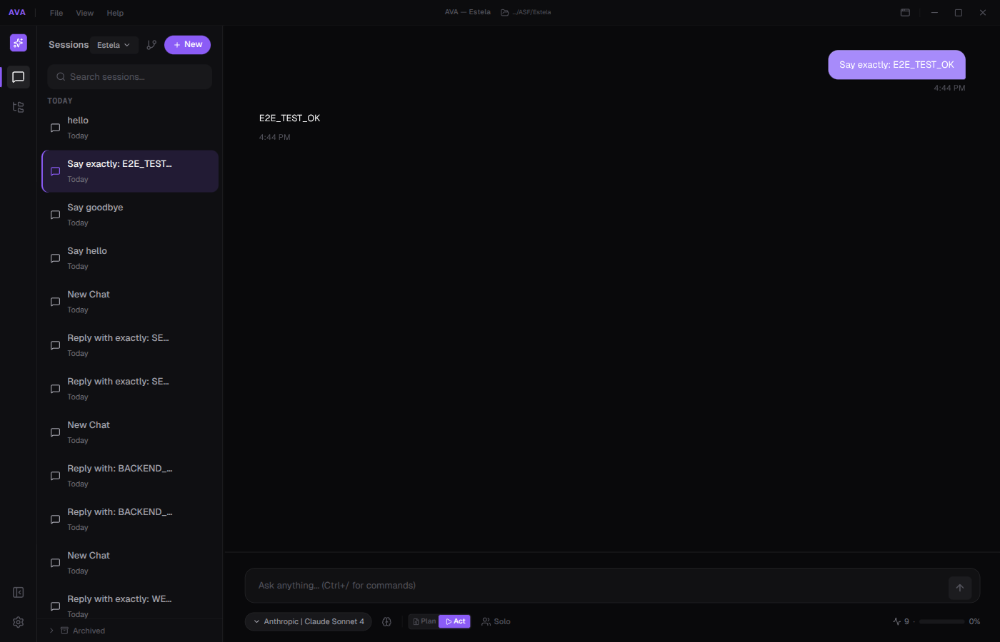

<div align="center">

# AVA

**A practical AI coding agent for terminal, desktop, and web.**

[](https://www.rust-lang.org/)
[](LICENSE)

AVA reads code, edits files, runs commands, and helps you finish software work without leaving your repo.




</div>

AVA is a Rust-first coding agent built for real repository work.

- Use `ava` in the terminal for interactive or headless runs
- Use AVA Desktop for a native desktop shell on top of the same backend
- Use web mode when you want browser access from `ava serve`

## Get Started

### Fastest Path

Install the CLI/TUI:

```bash
curl -fsSL https://raw.githubusercontent.com/Artificial-Source/AVA/develop/install.sh | sh
```

Download desktop builds from <https://github.com/Artificial-Source/AVA/releases> when bundles are published.

Add credentials:

```bash
ava auth login openrouter
```

Run AVA:

```bash
ava
ava "fix the login bug" --headless
ava serve
```

### Install Surfaces

| Surface | Best for | Fastest path | More options |
|---|---|---|---|
| `ava` CLI/TUI | Terminal and headless usage | `curl -fsSL https://raw.githubusercontent.com/Artificial-Source/AVA/develop/install.sh` piped to `sh` | [Install guide](docs/how-to/install.md) |
| AVA Desktop | Native desktop app usage | Download from <https://github.com/Artificial-Source/AVA/releases> | [Desktop guide](docs/how-to/download-desktop.md) |

### Release Artifacts

| Surface | Linux | macOS | Windows |
|---|---|---|---|
| `ava` CLI/TUI | `ava-tui-x86_64-unknown-linux-gnu.tar.xz` or `ava-tui-aarch64-unknown-linux-gnu.tar.xz` | `ava-tui-x86_64-apple-darwin.tar.xz` or `ava-tui-aarch64-apple-darwin.tar.xz` | `ava-tui-x86_64-pc-windows-msvc.zip` or generated Windows installer |
| AVA Desktop | `.deb`, `.rpm`, or `.AppImage` when published | `.dmg` when published | `.msi` or `.exe` when published |

### CLI / TUI

Other install paths:

1. Manual binary install on Windows, Linux, or macOS from <https://github.com/Artificial-Source/AVA/releases>
2. Source install:

```bash
git clone https://github.com/Artificial-Source/AVA.git && cd AVA
cargo install --path crates/ava-tui --bin ava
```

3. Guided source build:

```bash
./install-from-source.sh --help
```

Full install details: [docs/how-to/install.md](docs/how-to/install.md)

### Desktop

Desktop is the native desktop shell for AVA.

Quick path:

1. Open <https://github.com/Artificial-Source/AVA/releases>
2. Download the desktop bundle for your platform when that release includes one

Fallback path:

```bash
./install-from-source.sh --desktop
```

Desktop build and release details: [docs/how-to/download-desktop.md](docs/how-to/download-desktop.md), [docs/contributing/releasing.md](docs/contributing/releasing.md)

Release-repo note: release-related links in this checkout are aligned to `Artificial-Source/AVA`.

Security note:

1. Prefer AVA's connect flow, environment variables, or keychain-backed credential storage.
2. Avoid manually editing `~/.ava/credentials.json` unless you intentionally want plaintext local storage.

## What AVA Includes

- Solo-first coding agent
- 9 default built-in tools: `read`, `write`, `edit`, `bash`, `glob`, `grep`, `web_fetch`, `web_search`, `git_read`
- Works in TUI, desktop, and web
- MCP support
- Commands and Skills support
- Stable plugin architecture for optional advanced capability
- Session persistence and safety features for real repo work

## Supported Providers

AVA 0.6 actively supports and tests these providers:

1. Anthropic
2. OpenAI
3. Google Gemini
4. Ollama
5. OpenRouter
6. GitHub Copilot
7. Inception
8. Alibaba
9. ZAI / ZhipuAI
10. Kimi
11. MiniMax

Provider variants should appear as routing or region options inside a provider, not as separate providers.

## Customization

The main user-visible customization surface is:

1. MCPs
2. Commands
3. Skills

Plugins are a core part of AVA's identity, but plugin-owned UI and settings should only appear when installed.

## Configuration

```text
~/.ava/
├── credentials.json     # API keys
├── config.yaml          # core settings
├── mcp.json             # MCP servers
├── tools/               # custom tool definitions
├── themes/              # custom themes
└── AGENTS.md            # global instructions
```

## Documentation

Start here:

- [docs/README.md](docs/README.md) - main documentation entrypoint
- [docs/how-to/install.md](docs/how-to/install.md) - installation and platform notes
- [docs/reference/providers-and-auth.md](docs/reference/providers-and-auth.md) - providers, aliases, and auth
- [docs/reference/commands.md](docs/reference/commands.md) - slash commands and CLI surfaces
- [docs/testing/README.md](docs/testing/README.md) - testing and verification
- [AGENTS.md](AGENTS.md) - repo workflow, conventions, and architecture

Project and architecture material:

- [docs/project/roadmap.md](docs/project/roadmap.md)
- [docs/project/backlog.md](docs/project/backlog.md)
- [docs/architecture/README.md](docs/architecture/README.md)
- [docs/extend/README.md](docs/extend/README.md)
- [CLAUDE.md](CLAUDE.md)

## Contributing

```bash
just check
```

For the fuller verification flow and PR-era check policy (including hook behavior and desktop/frontend split), see:

- [How to run tests and checks](docs/how-to/test.md)
- [Development workflow](docs/contributing/development-workflow.md)
- [Testing and verification](docs/testing/README.md)

## License

[MIT](LICENSE)
